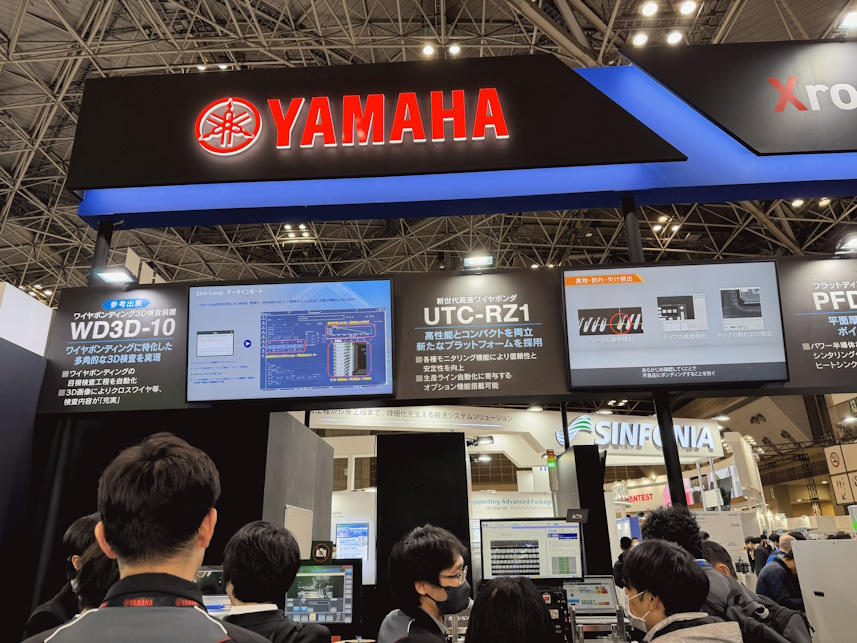
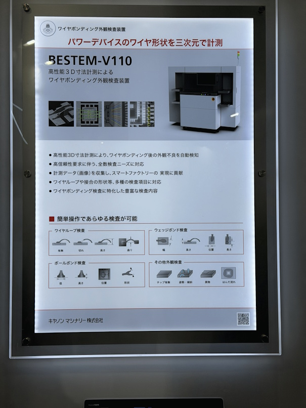
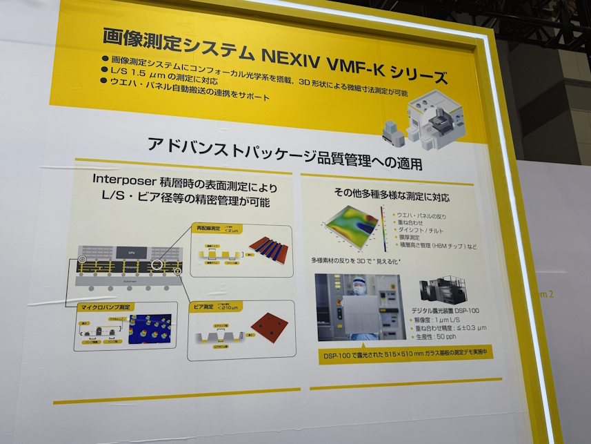

# SEMICON Japan 2025 見学レポート

* イベント名：SEMICON Japan 2025
* 日時：2025年12月18日（木） 15:00 〜 17:00
* 場所：東京ビッグサイト
* 参加者：先端技術開発部 浅沼 和範
* 目的：半導体検査工程に有用な技術動向の調査

---

## 1. 見学した主な製品一覧

| No. | メーカー / 製品名  | 分類  | 概要   | 
| --- | --- | --- | --- |
| 1   | YAMAHA WD3D-10 Full Auto  | ワイヤボンディング3D検査装置| ワイヤボンディングに特化した多角的な3D検査を実現 | 
| 2   | CANON BESTEM-V110  | ワイヤボンディング外観検査装置 | 高性能3D寸法計測によるワイヤボンディング外観検査装置| 
| 3   | Nicon NEXIV VMF-K   | 画像測定システム | 近フォーカル光学系による3D形状の微細寸法測定を実現 |

  

  

  

## 2. 各社比較

## 主要スペックの比較

| 項目 | WD3D-10 Full Auto | CANON BESTEM-V110 |Nicon NEXIV VMF-K |
| --- | -----: | ---: | ----: |
| 検査方式 Methodology | 2D＋3D Stereogram  (2D camera ×1 + 3D camera ×4) | 共焦点3D (Confocal 3D) | ニポウディスク走査式共焦点3D  （2D/高さ同時）|
| 対応可能 ワイヤ 材質   Available wire material | Au Wire (金線ワイヤ)  Cu Wire (銅線ワイヤ)  PCC Wire(パラジウム被覆銅ワイヤ)  Ag Wire (銀線ワイヤ) | ウェッジ／ボール／クリップ | <i>未確認</i> |
| 対応不可 ワイヤ 材質   Not Available wire | Heavy wire（ヘビーワイヤー） Wedge bond（ウェッジボンド）  Ribbon bond（リボンボンド）  Crimp bond（クリンプボンド） | <i>未確認</i> | <i>未確認</i> |
| 対応可能 線径 Wire Diameter | 18µm ~ 50µm （>50µm is under evaluation） | 17µm ~ 400µm  | <i>未確認</i> (bonding wires測定ツールについて言及あり)|
|装置サイズ Dimensions|W 1,020 x D 900 x H 1,400 mm LD(Load)/ULD (Unload)除く|W 1,955 × D 1,000 × H 1,680 mm （シグナルタワー除く）|VMF-K3040：1,146×1,247×1,973mm VMF-K6555：1,198×1,640×1,973mm|
|重量 Weight|850 kg|900 kg|800 kg|
| 検出視野 FoV(Field of Viee)| 10mm ×10mm | 10mm × 12mm | 7.80 × 5.82mm  （対物1.5×で共焦点/倍率で変動） |
| 検査高さ範囲 Depth Range | Max 2.0mm（±1.0mm）| 4.0mm |  1.0mm  |
| 検査精度（分解能） Camera Resolution |  2D：5µm(3σ) / 3D：10µm~15µm(3σ) | 鉛直:2.0µm(3σ) / 水平:5.0µm(3σ)  |  高さ繰返し 0.2µm~0.6µm(2σ) （倍率条件で変動） |
| 検査時間 Inspection Time | 1.0~1.2sec/IC  FoV:8mm  chip size:6mm(80pin)  Test wafer:SKW STD-6 | <i>未確認</i> | <i>未確認</i> |

## WD3D-10 の強み

### 検査時間（タクト）

* 他社の検査時間は明記されていないが、一般的に「フォーカスをZ方向に動かしてどの高さでピントが合うかを探すタイプ（Zスタック）」と比較すると、ステレオ計測方式のほうが高速になりやすい。

## WD3D-10 の弱み

* 対応線径（ワイヤ径レンジ）が狭い（特に太線）
  * WD3D-10：18〜50µm（>50µm評価中）
  * BESTEM-V110：17〜400µm
  * パワー系・太線・将来品種拡張を考えるとWD3D-10は不利。

* 検出精度（分解能）で不利
  * WD3D-10：3D 10µm〜15µm（3σ）
  * BESTEM-V110：鉛直 2.0µm（3σ）
  * NEXIV VMF-K：高さ繰り返し 0.2µm〜0.6µm（2σ）
  * WD3D-10の高さ性能が最も粗い。ループ高さの公差が厳しい工程では不利。

* FoV（検出視野）がBESTEM-V110より小さい
  * WD3D-10：10mm × 10mm
  * BESTEM-V110：10mm × 12mm
  * 1ショットで収められる範囲が狭い分、品種によっては 撮像回数でタクトが悪化する可能性がある。

## 3. 補足（用語）

## 共焦点3D（Confocal 3D）

### ステレオ方式との違い

* ステレオ方式（Stereogram / Stereo vision）
  * 複数カメラ（視点）から見た画像の「対応点」を探して、視差から高さ（3D）を復元する。

* 共焦点3D（Confocal）
  * ピントが合った深さの光だけを取り出す光学（ピンホール効果）で、焦点位置と反射強度から高さを得る。
  * 「焦点面に合う位置＝その点の高さ」という測り方。

### 強み
* 絶対高さが取りやすい（幾何復元より“高さ計測”に寄る）
* 微小段差・微小凹凸に強い（繰り返し精度が良いことが多い）
* 表面テクスチャが乏しい対象でも測れやすい
  ステレオは対応点（模様）がないと不安定になりやすい。

### 弱み
* Z方向のスキャンが必要（方式によってはタクトが伸びる）
* 反射率や傾斜、材質によっては信号が弱い/飽和し、取りづらい条件がある
* 装置が複雑化・高コストになりがち

## ニポウディスク走査式共焦点3D（Nipkow disk confocal）

### 通常の共焦点3Dとの違い（要点）

* 通常の共焦点（点走査/ライン走査）
  * 1点ずつ（または線）をスキャンして面を作る
    → 高精度だが、面取りは時間がかかりがち

* ニポウディスク式
  * 回転ディスクに多数のピンホール（またはマイクロレンズ＋ピンホール）を配置して、同時並列に多数点を共焦点取得
    → 面を高速に取れる（“共焦点の高速化版”）

### 何が嬉しい

* 2D画像＋高さ情報を比較的高速に同時取得しやすい
* 「測定機」用途で、繰り返し精度やスループットを両立しやすい

## Au / Cu / PCC / Ag Wire（ワイヤ材の特徴と用途）

### Au Wire（金線）

* 特徴：加工・接合が安定、信頼性が高い、酸化しにくい
* 弱点：高価、近年はコスト面で置換が進む
* 用途：高信頼性要求（医療、宇宙、重要部位）

### Cu Wire（銅線）

* 特徴：低抵抗・高強度、材料コストが低い
* 弱点：酸化しやすい／接合条件がシビアになりやすい
* 用途：民生～車載まで広く、コスト重視の量産

### PCC Wire（Pd coated Cu：パラジウム被覆銅）

* 特徴：銅線表面をPdで被覆して、耐酸化・接合安定性を改善しやすい
* 弱点：Cu単体より材料コストは上がる
* 用途：Cuへ置換したいが、信頼性や工程安定性も確保したい場合の中間解

### Ag Wire（銀線）

* 特徴：電気伝導性が高い（抵抗が低い）／比較的低コスト化の選択肢として使われることがある
* 弱点：材料・プロセスはライン依存で、実装条件の相性がある
* 用途：コストと電気特性のバランスを狙うケース（採用は工程・信頼性要求による）

## Heavy wire（ヘビーワイヤ）

* 特徴：太いワイヤ（一般に 50µm超～100µm級、さらに太い領域）
  → 大電流向け。ループも大きく、形状変形も大きい。
* 用途：パワー半導体（IGBT、MOSFET、SiC/GaNモジュールなど）、産業・車載の高電流接続
* 検査上の意味：
  * 太い・光沢が強い・高さも大きい → 見え方が厳しい
  * 断線/剥離/接合部の不良モードも細線と違う
    → 装置が「非対応」と明記されることがある

## Wedge bond / Ribbon bond / Crimp bond（特徴と用途）

### Wedge bond（ウェッジボンド）

* 特徴：くさび形工具で押し付けて接合（ボールボンドと形が違う）
* 用途：AlやCuで多い。パワー寄りや特殊形状にも使われる
* 検査ポイント：スティッチ形状、潰れ量、リフト、擦れ、位置ずれなど

### Ribbon bond（リボンボンド）

* 特徴：丸線ではなく平たい帯（リボン）を接合
* 用途：パワー・高周波（低抵抗/低インダクタンスを狙う）
* 検査ポイント：帯の端部、面密着、ねじれ、潰れ、幅方向の欠けなど
  → 丸線ワイヤ用アルゴでは検出思想が合わないことが多い

### Crimp bond（クリンプボンド：圧着/かしめ）

* 特徴：溶着ではなく、かしめて機械的に固定する接続
* 用途：端子・リードへの接続など（ワイヤループ検査とは別カテゴリ寄り）
* 検査ポイント：かしめ量、変形、抜け、位置、導通など
  → ワイヤボンド検査機だと「非対応」になりやすい

## LD(Load) / ULD(Unload) とは？

装置における 搬入・搬出の周辺機構のこと。
* LD（Load）：ワーク（トレー/リードフレーム/基板等）を装置へ投入する側のユニット
* ULD（Unload）：検査後にワークを排出する側のユニット

仕様表で
* 「LD/ULD除く」＝装置本体のみの寸法・重量
* 「LD/ULD含む」＝搬送ユニット込みの寸法・重量
  という意味で書かれる。

-EOF-